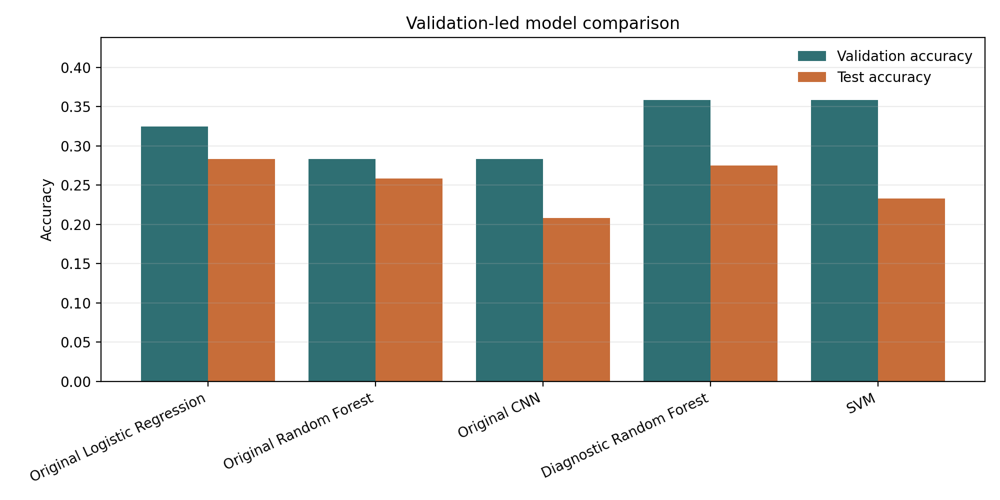
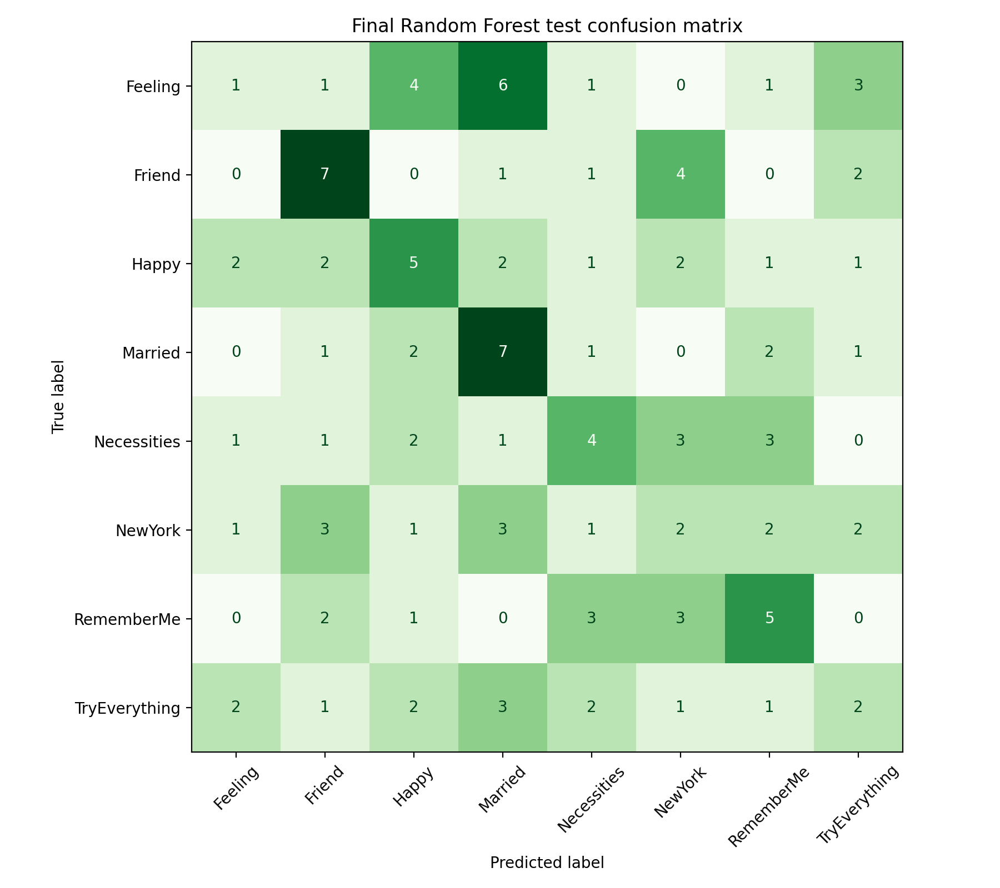
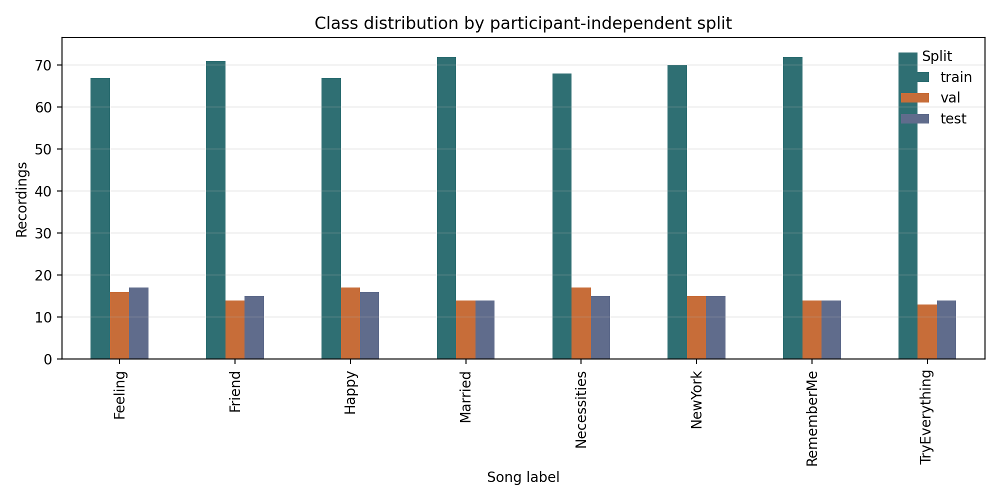

# Audio Song Classification from Humming and Whistling


## Project Overview

This repository presents a reproducible machine learning study for classifying songs from short humming and whistling recordings. The project investigates how well classical machine learning and convolutional audio models can identify one of eight song labels from noisy, participant-generated audio.

The final pipeline uses a participant-independent train/validation/test split, reproducible metadata generation, deterministic feature extraction, saved metrics, model artifacts, classification reports, and error analysis. The strongest final portfolio model is a validation-selected Random Forest trained on compact audio summary features.

## Motivation / Problem Statement

Query-by-humming systems are a challenging audio classification problem because the same song can be expressed with different pitch ranges, tempos, vocal quality, recording devices, and levels of melodic accuracy. The goal of this project is to evaluate whether short hummed or whistled clips contain enough signal for supervised classification under an honest evaluation protocol.

The central methodological question is not only "which model scores highest?", but "which model generalizes to unseen participants?". To answer that, the repository avoids participant leakage by ensuring that recordings from the same participant never appear in more than one split.

## Dataset Description

The study uses the local MLEnd Humming and Whistling II 800-file sample.

- Recordings: 800 `.wav` files
- Participants: 187 unique participant IDs
- Classes: 8 song labels
- Input styles: humming and whistling
- Metadata source: labels parsed from filenames such as `S100_hum_2_Married.wav`
- Main dataset path: `data/MLEndHWII_sample_800/`

Song labels:

| Label |
|---|
| Feeling |
| Friend |
| Happy |
| Married |
| Necessities |
| NewYork |
| RememberMe |
| TryEverything |

The older 400-file sample is not used for corrected evaluation because it overlaps with the 800-file sample.

## Methodology

### Preprocessing

Audio preprocessing is implemented in `src/features.py`:

- Load `.wav` audio as mono floating-point samples.
- Normalize each signal by peak amplitude.
- Resample recordings to the project target sample rate.
- Pad or truncate each recording to a fixed 10-second analysis window for the final model.
- Cache extracted features for repeatable reruns.

### Feature Extraction

The final selected feature representation is a compact combined summary vector. It aggregates statistics from:

- MFCCs
- MFCC deltas
- Log-mel spectrogram summaries
- Chroma summaries
- Dominant-frequency descriptors
- Spectral shape descriptors such as centroid, bandwidth, and rolloff

Earlier baseline experiments also evaluated flattened MFCC-style features and log-mel spectrogram inputs for CNN models.

### Participant-Independent Split

The corrected split is subject-aware: each participant ID is assigned to exactly one of train, validation, or test.

| Split | Recordings | Unique Participants |
|---|---:|---:|
| Train | 560 | 129 |
| Validation | 120 | 29 |
| Test | 120 | 29 |

The split is generated with a fixed random seed (`42`) and saved to `results/splits.csv`.

### Evaluated Models

The project compares:

- Logistic Regression on original-style flattened MFCC features
- Random Forest on original-style flattened MFCC features
- CNN on log-mel spectrograms
- Diagnostic Random Forest on compact combined audio summaries
- RBF-kernel SVM on compact combined audio summaries

## Experimental Pipeline

The repository is organized as a script-based experiment pipeline:

1. Build metadata from local audio files.
2. Create a subject-aware train/validation/test split.
3. Extract deterministic audio features.
4. Train baseline and diagnostic models.
5. Select the final model using validation performance.
6. Evaluate the selected model once on the held-out test split.
7. Save metrics, classification reports, confusion matrices, and model artifacts.

```text
data/MLEndHWII_sample_800/
        |
        v
src/build_metadata.py -> results/metadata.csv
        |
        v
src/create_splits.py -> results/splits.csv
        |
        v
src/train_final_model.py
        |
        +-> models/final_random_forest.joblib
        +-> results/final_random_forest_metrics.csv
        +-> results/classification_reports/final_random_forest_test.txt
        +-> figures/confusion_matrix_final_random_forest.png
```

## Final Model Comparison

The table below reports the saved corrected-evaluation results from `results/final_model_comparison.csv`.

| Model | Features | Duration | Validation Accuracy | Test Accuracy | Macro Precision | Macro Recall | Macro F1 | Weighted F1 | Notes |
|---|---|---:|---:|---:|---:|---:|---:|---:|---|
| Original Logistic Regression | Flattened MFCCs with original-style train augmentation | 10s | 0.3250 | 0.2833 | 0.3253 | 0.2786 | 0.2878 | 0.2922 | Original corrected baseline; highest test score but not selected as final because later choices should be validation-led |
| Original Random Forest | Flattened MFCCs with original-style train augmentation | 10s | 0.2833 | 0.2583 | 0.2628 | 0.2618 | 0.2557 | 0.2541 | Original corrected baseline |
| Original CNN | Log-mel spectrograms with original CNN architecture | 10s | 0.2833 | 0.2083 | 0.1645 | 0.2102 | 0.1440 | 0.1449 | Experimental/weak CNN baseline; not recommended as final |
| Diagnostic Random Forest | Combined compact summaries: MFCC/delta/log-mel/chroma/pitch/spectral | 10s | 0.3583 | 0.2750 | 0.2581 | 0.2797 | 0.2629 | 0.2594 | Validation-selected diagnostic model; recommended final portfolio model |
| SVM | Combined compact summaries: MFCC/delta/log-mel/chroma/pitch/spectral | 10s | 0.3583 | 0.2333 | 0.2524 | 0.2351 | 0.2337 | 0.2333 | Strong SVM baseline; did not outperform diagnostic RF on test |



## Final Selected Model and Justification

The final selected model is the Diagnostic Random Forest:

- Features: compact combined summaries of MFCC, MFCC deltas, log-mel, chroma, pitch, and spectral descriptors
- Duration: 10 seconds
- Split: participant-independent train/validation/test split
- Validation accuracy: `0.3583`
- Validation macro F1: `0.3537`
- Test accuracy: `0.2750`
- Test macro F1: `0.2629`

The model is selected because it was chosen by validation performance after controlled diagnostics, then evaluated on the test split. Although Original Logistic Regression has a slightly higher observed test macro F1, selecting it after seeing the test set would make the final choice test-led. The Random Forest is therefore the more defensible portfolio model because its selection process better reflects reproducible ML practice.

The Random Forest is also appropriate for this dataset size because it can model nonlinear interactions across heterogeneous handcrafted audio features without requiring the amount of data typically needed for robust deep learning.

## Key Findings

- Participant-independent evaluation substantially reduces apparent performance compared with contaminated or overlapping evaluation setups.
- Data splitting quality is a first-order issue in small audio datasets.
- Compact handcrafted feature summaries are competitive with more complex models for this dataset scale.
- CNN performance is weak under corrected evaluation, making it an informative negative result rather than a final model candidate.
- The final Random Forest generalizes better than the validation-matched SVM on the held-out test split.
- Model rankings are sensitive because the validation and test sets are small.

## Error Analysis Summary

The final Random Forest reaches test accuracy `0.2750` and test macro F1 `0.2629`, showing that the corrected task remains difficult.

Per-class test behavior from `results/classification_reports/final_random_forest_test.txt`:

| Class | Precision | Recall | F1 | Support |
|---|---:|---:|---:|---:|
| Feeling | 0.14 | 0.06 | 0.08 | 17 |
| Friend | 0.39 | 0.47 | 0.42 | 15 |
| Happy | 0.29 | 0.31 | 0.30 | 16 |
| Married | 0.30 | 0.50 | 0.38 | 14 |
| Necessities | 0.29 | 0.27 | 0.28 | 15 |
| NewYork | 0.13 | 0.13 | 0.13 | 15 |
| RememberMe | 0.33 | 0.36 | 0.34 | 14 |
| TryEverything | 0.18 | 0.14 | 0.16 | 14 |

The strongest final-model classes are `Friend`, `Married`, and `RememberMe`. The weakest classes are `Feeling`, `NewYork`, and `TryEverything`. These errors are consistent with the difficulty of distinguishing short, noisy melodic fragments when timing, pitch range, and participant style vary substantially.





## Repository Structure

```text
audio-song-classification/
+-- data/
|   +-- README.md
|   +-- MLEndHWII_sample_800/          # Local raw audio, not committed
+-- figures/
|   +-- confusion_matrix_final_random_forest.png
|   +-- model_comparison_accuracy.png
|   +-- split_class_distribution.png
+-- models/
|   +-- final_random_forest.joblib
+-- results/
|   +-- classification_reports/
|   |   +-- final_random_forest_test.txt
|   +-- development_summary.md
|   +-- error_analysis.md
|   +-- final_model_comparison.csv
|   +-- final_model_selection.md
|   +-- final_random_forest_metrics.csv
|   +-- metadata.csv
|   +-- project_discussion.md
|   +-- splits.csv
+-- src/
|   +-- build_metadata.py
|   +-- create_splits.py
|   +-- features.py
|   +-- train_final_model.py
|   +-- train_svm.py
|   +-- utils.py
+-- archive/
+-- README.md
+-- REPRODUCIBILITY.md
+-- requirements.txt
```

## Installation

Use Python 3.10 or newer.

```bash
git clone <repository-url>
cd audio-song-classification
python -m venv .venv
source .venv/bin/activate  # Windows: .venv\Scripts\activate
pip install -r requirements.txt
```

Place the 800-file audio sample at:

```text
data/MLEndHWII_sample_800/
```

## Reproducing the Experiments

Run the main final-model pipeline from the repository root:

```bash
python src/build_metadata.py
python src/create_splits.py
python src/train_final_model.py
```

Optional SVM baseline:

```bash
python src/train_svm.py
```

Expected final-model outputs:

- `results/metadata.csv`
- `results/splits.csv`
- `models/final_random_forest.joblib`
- `results/final_random_forest_metrics.csv`
- `results/classification_reports/final_random_forest_test.txt`
- `figures/confusion_matrix_final_random_forest.png`

For a compact reproducibility checklist, see `REPRODUCIBILITY.md`.

## Project Highlights

- Reproducible script-based ML pipeline rather than notebook-only experimentation.
- Participant-independent split to avoid subject leakage.
- Clear separation of raw data, metadata, splits, results, models, figures, and archived experiments.
- Validation-led final model selection.
- Saved model artifact and evaluation outputs.
- Honest reporting of negative results, including weak CNN behavior under corrected evaluation.
- Error analysis grounded in saved classification reports and confusion matrices.

## Future Work

- Add subject-aware cross-validation for more stable performance estimates.
- Use a pinned environment with a dedicated audio library such as `librosa`.
- Evaluate melody-preserving representations such as pitch contours, interval sequences, dynamic time warping, or sequence models.
- Explore confidence calibration and abstention for ambiguous recordings.
- Add more detailed recording-quality diagnostics.
- Revisit neural models only with stronger regularization, more data, transfer learning, or architecture search constrained by validation performance.

## References

- MLEnd Humming and Whistling II audio sample.
- scikit-learn documentation: Logistic Regression, Random Forest, SVM, metrics, and model persistence.
- SciPy documentation: WAV loading, FFT, signal processing, and resampling utilities.
- NumPy and pandas documentation for numerical computation and tabular experiment artifacts.
- Matplotlib documentation for confusion matrix and experiment visualization.
